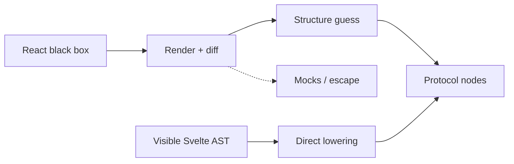
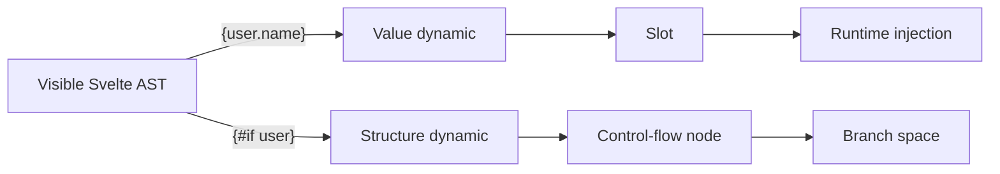
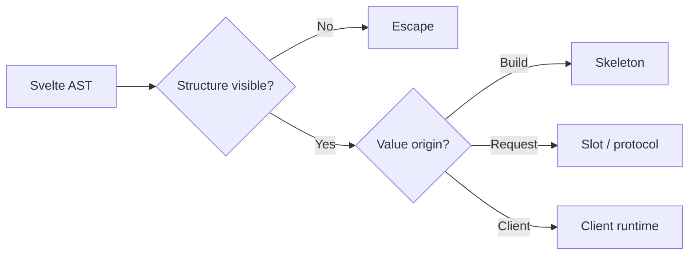
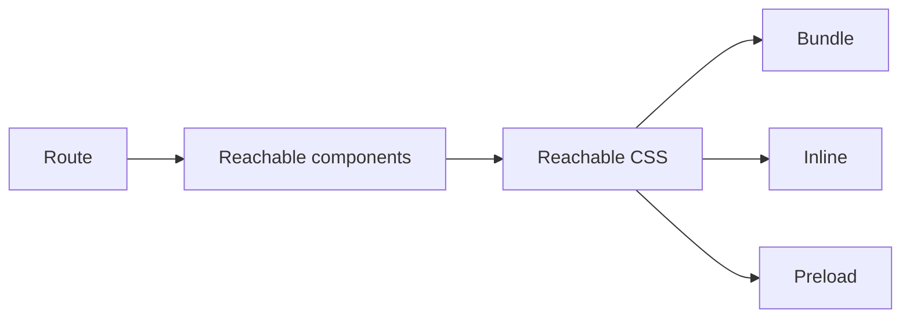
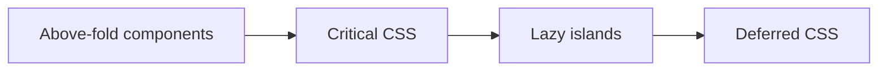

今天已经是我 move 到 US 来的整整一个月了；落地 NC 日常安顿好后，周围的地区和比较近的景点也基本上逛完了，那么人就闲下来了。但是恰恰好我就不是什么闲人，人一旦闲下来就会给自己找点事情干 ~~捡起博客不就算一件嘛~~，但是不巧 US 这边物流不是很方便，所以板子暂时画不了，那就只能回来写点软件水水了，顺便把几个月前丢掉的坑捡起来填上?

## Model {#request-time-model}

大概从今年下半年开始，我把本站完全从 `TanStack Start` **React** 完全 `port` 为了 `SvelteKit` **Svelte** 全部迁移完之后，我发现它确实很好：`ssr` 的性能开销差不多降了一个数量级别，水合开销非常小，跑起来很舒服，框架编译的哲学也非常棒、非常轻量。但是 `Kit` 的部分总有一些让我觉得很不尽人意的地方。但是这其中大部分可以通过插件解决~~毕竟是 Vite 拼的~~ ，但是总是又一些部分是不能动的；但是这大概率也是我的问题，因为我想要改的地方可能和任何一个存在的 `meta` 框架都有本质上冲突，~~本质上是我在挑战他们的 执行模型(每请求跑 render 函数)、数据边界(load 和 UI 糊在一起)、后端能力(绑死 JS runtime)~~.

## 不只是 SSR {#beyond-ssr}

这里不用想肯定有人问：这不就是 `Astro` / `Qwik` / `Marko` 嘛，语言形状上 `Marko` 最近，默认少 JS 上 `Astro` 最近，不 `replay hydrate` 上 `Qwik` 最近；但我想说的是他们的 `request-time` 仍是在跑 UI 程序：`island` 各自 `render`、`Qwik` 那次 `SSR`、`Marko` 编译出来的 JS 模板函数，都还是每请求执行一块 `renderer`; 那 `{#each}` 一千条本质上我也还是在拼 `HTML`，所以我不是不生成文档，而是区别在于我拼的是已经封闭的协议，而不是重新生成组件树，`Seam` 要的是 `AST` → `IR` → 带 `slot` 的 `HTML`，请求时只解释协议、做 `injection`，那份 **UI render** 函数早已经不跑了，所以任意后端都能填已经 `residual` 化的那最后一层。所以结论不是「`HTML` 优先我没看过」，而是没有现成的把编译期骨架和协议填槽接成同一条主路径。

## Adopt {#adopt-without-replay}

Seam 会水合，但不是传统那种，也不是 Qwik 那种。传统水合是客户端再 `render` 一遍对拍 `DOM`；Qwik 是 `SSR` 出 `HTML` + 组件状态，客户端 `resume`，不 `replay`; Seam 的 **request-time** 连这份 **UI renderer** 都不跑：骨架、首屏、`hydrate` 数据来自同一次 `injection`. 客户端拿到的是已经对的 `DOM` + 同一份数据，按编译期 `IR` 把事件和 **client state** 挂上去 `adopt`，不是 `replay`，也自然不是 `resume` 一棵组件树。

正因如此「两边各 render 一次再对拍」这类 `mismatch` 已经从默认变成了非法状态。窝并不是宣称实现已经 100%，是这类偏差在模型里不合法：出现了就是我 `compiler` / `injector` 实现中的 `bug` 可以被 `fix`，典型的举例就是 (~~骨架没过 HTML parser、转义对不上、IR 和骨架不同步~~)。

当然 `skeleton` 自己得是 `parse-stable` 的，`table` 里乱塞 `comment` 那种算实现没处理好，别算到窝模型头上。**Build-time** 算的是水合映射（谁静态、谁是 `slot`、绑什么），不是把数据提前算死，但却固定死了这个 `slot` 的数据类型。数据值本身仍然是 **request-time** 可以任意换的；只不过 `HTML` 和 `payload` 必须是同一份。

---

## 同图? {#living-component-graph}

`Astro` 虽然首屏也是文档，后面也能 `ClientRouter`，但差别是它的动态部分仍是 `islands` 各自 `render`，**ClientRouter** 本质更像 `document morph`，而不是水合后同一张还活着的组件图。所以 Astro 的技术栈上就不适合做这个，它本身没错，只是不是设计给你这样用的，你当然可以说有 **View Transitions API** 可以用，~~那这样我就要问你了 View Transitions API 可以当饭吃嘛，能让你跨页面套 Motion 动画嘛~~... 扯远了点；

反正水合前谁都动不了，首帧 JS 起来之前的动画没有本来就不是任何人的错；`Seam` 也只是保证 `injection` 对、`document` 对、`client` 入口对，这里真正的约束在水合之后：`client` 导航是把数据打进还活着的那张图来做 ~~(layout 持久)~~，而不是再走一遍 `injection` 换 `document`. 总之 **Seam 水合后接管的是同一张静态组件图**。

这里其实还有 Marko 6 已经很接近我的想法了 (模板 **AST**、编译期细粒度、**resume** 不 **replay**)；但是和 `Marko` 比起来在技术上能划的线主要就两条，第一个是 `request-time` 还在跑 JS 编译产物、整条链绑死 JS runtime；~~以及作者用的语言是 Marko 不是 Svelte~~，我相信大部分人在聊前端的时候肯定 26年只会把 `React`, `Vue`, `Svelte`, `Solid` 考虑为比较主流的 **UI Stack** 吧，如果我不说很多人甚至可能连 `Marko` 是什么都不知道，那么建立在 `Svelte` 上其实不是「*复制一份再加个 backend*」，我更多是像借已经有人写、有人用、有人修还有人在不断打磨的那套 UI 出来用，都是大家熟悉的内容，还有就是 `Qwik` 的「不水合」省的是客户端 replay，但是没有省掉服务端那次 SSR(?)

所以很遗憾，而目前没有任何一个框架能满足我，或者给我足够的 API 让我有做加法的可能，这也是为什么几个月前我会去做 SeamJS 这个东东；那么今天其实也就是来重新规划一下它的 `roadmap`.

现在的我非常认同「***Svelte: for building, not frameworking.***」

## React {#leaving-react}

先说 `React` 吧，抛开被 **Vercel** `Next.js` 商业绑定和 它有自己的 `roadmap` 不谈，首先它 **CVE** 满天飞，~~光这点就注定了你每时每刻都要盯着 **Social Media** 看有没有新的漏洞被 **report & release**~~. 其他家的 **Router** 基本处于不可用状态特别是 **Remix**，但 26年 有一个非常特别的选项，那就是 **TanStack** **Start**，我很早就用 **TanStack Router** 了，对此可以给出~~除了命名风格和数据结构做的不是很美观~~，但是从功能性上来说这是我唯一认可的选项。新是新了点，但是它解决了 **Next.js 16** 的 `next-server` 进程至今都没有解决的冷启动页面首次访问速度问题，**Next.js** 其实一直莫名其妙会有这个卡顿问题，不是服务器性能不够，实际上我会归因为要么是 启动 **Load** 没有加载完成，那么就是 `runtime` 还在编译某些内容。~~而且这个结构注定了不太适合 **Cloudflare Worker** 那种多地实例 最近启动的原则~~，只有 **Vercel** 那种传统 **Node 长进程**不会吃到这个问题(?) ~~有点扯远了，关于 Next.js 以后可以单独写一整片来吐槽~~，但是 **TanStack** 真的是我认为已经足够成熟到可以商业使用了，至少我有给某项目的销售站用上了。但这仅仅是唯二的选项(x)

## Vue {#why-not-vue}

Vue 的话我个人从 Vue 2 迁到 Vue 3 的时候，对语法等机制就不太认同了，我心中的 Vue 永远是 Vue2。不可否认的是 Vue 3 有很多很棒的 `feature`，但对比 Vue 2，它的核心对我来说感觉变了；而且变得很大。另外从商业角度上来考量 `Vue` 越来越被 meta 层彻底绑死、被生态控制？处境感觉和 `Svelte` 非常相似，都是开源，但是真的基本上很难有第三者站出来给你做第二个实现，这也是为什么 **TanStack Start** 加入的洗牌给 **Next.js** 的打击真的很大，这也是为什么我非常钦佩 [Tanner Linsley](https://x.com/tannerlinsley). 另外还有一点也是 `Vue` 的一个不可忽略的问题，早年的 `Vue` 确实是一种革新；但是任何 **UI Stack** 在生态起来后都会遇见生态问题，~~也就是为了兼容性而出现一定的妥协?~~ 特别是这个问题在 `React` 上真的非常明显，现在的 `Vue` 也不例外，开始出现这种内容的时候一般我就会考虑为 **Slop** 了，~~但是也不能说它不好~~，因为当 Nuxt 成为下一个 "企业级" 的框架后，首要的考量已经不再是技术正确不正确，优雅不优雅，而是某些向后兼容 + 稳定性(x    所以 [Evan You](https://github.com/yyx990803) 其实并没有做错什么，甚至乎可以说有人必须站出来当这个 ~~坏人~~ 而他恰好就是最合适的人选，只是做了最合适的决定而已。

## Solid {#solid-ecosystem}

**SolidJS** 框架很好、核心也足够稳定，~~但没人愿意给它写生态~~。`Solid` 其实就是早年的 `Rust`，但是 `Rust` 已经挺过来了，`Rust` 在编程领域确实也有类似生态少什么都要自己造轮子的处境，但 `Rust` 工具链能顺滑的让你把轮子造出来、让最小可用单元跑起来，造轮子的难度其实并不是很大？但是很不幸 **SolidJS** 暂时还没有挺过这个阶段，但是就遇到了 **AI 寒冬**；尤其是会在 26年后变得非常困难，Solid 2.0 核心已经很好了也很稳定，但是外围没滚起来，想法非常对，只是可惜生不逢时；就算有少数几个外围，那也只存在于某一两个零散的方面 ~~(比如 TanStack 就有 Solid 实验 Router)~~ 拼不起完整生态。这让它在当前以及未来都处于一个尴尬的位置：没有完整生态，在如今 Agent 爆炸的时代；雪球还没滚起来那么 Agent 就不会优先选择它，如果 AI 都不会优先偏好他意味着更少的机会得到贡献，尤其是当 [Linus Torvalds](https://github.com/torvalds) 都开始 Vibe 的年代，感觉 Solid 很遗憾，想法很好、技术很正确、实现很优雅，但是真的是很可惜它生不逢时...

---

## 平衡点 {#svelte-balance}

那么在这条路上，恰恰踩在最完美平衡点上的其实只有 **Svelte** 了。它拥有比 **SolidJS** 更好的生态 ~~(更好的出生年代)~~，性能也没有差多少，甚至有时候受益于它的 **Compiler**，它很多时候甚至比 **SolidJS** 更快更优?!   当然这里肯定会有人说页面数量上升到一定量级或者用户浏览得越多的时候 Svelte 的资源开销对比 SolidJS 会越来越大？网络请求会越来越多？ Well, 理论上这是事实，~~但是我觉得得结合真实网页来看，99.9% 的个人网站或内容网站，访客基本上都不会停留太久，逗留很久甚至可以考虑为是非常**罕见**的情况~~。至少在我这个站上，目前来说深度连点极少，所以「翻很多页 = Svelte 更亏」对我不构成问题。但这不是选 Svelte 的理由；其实核心还是 **markup AST**.

另外就是 Dashboard 在这种会把页面点开的东西，这条统计帮不上忙，但是毕竟 Dashboard 的用户对比真的内容受众用户还是少的嘛不是。所以「浏览极多页面导致开销变大」我认为本质上是个**伪命题**；至少现在是，~~也许以后我会有不一样的看法~~，但是在现在这个快节奏的信息时代，我很难不承认这类用户极少；即便有人因为感兴趣而深度探索并转化为长期粉丝，这种探索大概率也只发生在第一次访问，后续他们也只是来看看新发的文章而已；可以说从统计学回报来看，这种极端情况并不成正比。因此我更愿意相信：**大部分场景下 Svelte 能带来更好的综合性能**。

:::quadrant{title="UI stack fit" description="Frameworks are grouped by ecosystem reach and compile-time leverage without implying precise scores." left="Niche" right="Mainstream" top="Compiler" bottom="Runtime"}
::quadrant-item{at="top-left" title="Solid"}
::quadrant-item{at="top-left" title="Marko"}
::quadrant-item{at="top-right" title="Svelte"}
::quadrant-item{at="bottom-right" title="React"}
::quadrant-item{at="bottom-right" title="Vue"}
:::

那么选 **Svelte** 真的只有这点原因嘛？当然不是，**Svelte** 对上述 3个框架除了处境和位置比较合适之外，还很贴近裸 `HTML` 的感觉？甚至早年 Svelte 3 刚普及、`.svelte` 扩展名刚定下来的时候；官方的 VSC 插件出来之前这么做甚至是推荐的，以至于现在你还能在 [Svelte 的插件页面](https://marketplace.visualstudio.com/items?itemName=svelte.svelte-vscode) 找到这句话:

> If you added `"files.associations": {"*.svelte": "html" }` to your VSCode settings, ***remove it***.

另外就是 **Svelte** 还 Offer 了很多好处给我，最直接的就是不把 UI 推向 `JSX` + 一堆 `JS function`，以及 `<style>` 是编译期产物、而不是 `runtime` 前者让结构留在 `markup AST` 里；后者让 CSS 能直接进入 IR 而 Tailwind 刚好两边都能贴（

## Black box {#react-black-box}

就像上一篇写过的，`Seam` 首先是一套协议，不是又一个 **SSR runtime**. **Build-time** 产出带 `slot` 的 `HTML skeleton`，**request-time** 只做 `injection`；`if` / `each` / `match` 也是协议节点，只可惜之前我 UI 选了 React 开始动刀，不幸的是在 React 上面想实现捕捉页面结构并产生变体的话非常困难，改编译器的话工作量不亚于重写一个...



不改的话还可以把 React 编译器当成一个黑盒，然后真的执行一堆 `render` + `diff` 猜结构出来用，`nullable` / `enum` 这种有限决策还能穷举，一旦碰到 `price > 10` 这种谓词，类型值空间根本乘不完。~~V1 里遇到这种情况只会让你手动给 mock~~，比如 `price < 10` / `= 10` / `> 10` 切三刀再跑，但是问题也就出在这里，要实现这一精确的切 3刀就会要求你知道切点在 10，但是很不幸 React 编译器对我来说是不透明的，我们并不知道条件是什么，于是 TypeSafe 的代价变成用户在做编译器的活 (~~注意这里这里的 TypeSafe 跟 TypeScript typecheck 没关系~~)。理论上这个不该丢给用户，不然结果就是 `escape` 满天飞，CTR 覆盖的还是那点 `nullable` / `enum`，结构发现等于没做，于是不知道还有多大的意义了。

但是这次要改的不是协议本身，原来说的 `skeleton`、`slot`、`injection` 我觉得其实可以保留，后端也还是可以不跑 UI 代码，只是要改的是协议前面那一层：关于回答页面怎么被编成这些节点的问题。那么这里就不得不感谢来自 `Svelte` 给我最大的礼物了，那就是 `markup`, 因为 **markup** 的结构根本不用我来猜！！！

## Visible AST {#visible-template-ast}

只凭「markup 是真的 markup」这一点，页面结构就绝对有机会成为编译器能读的东西，而不是一堆 runtime JS 执行出来的组件树。咱就是说好好的 UI 为什么一定要能任意执行绘制呢？(~~我并不是否认这个观点，但是我想说的是 至少 97%+ 的时间 任意执行绘制是用不上的，具体可以[**参考这里**](https://canmi.net/architecture/compile-time-rendering#ctr-x-ssr)~~)

举个反例，React 里面的

```typescript
function Card({ user }) {
  return user
    ? <div className="card">
        <Avatar user={user} />
        <span>{user.name}</span>
      </div>
    : null
}
```

**本质上还是执行一个 JavaScript function**，看看它返回什么，哪怕编译器非常聪明，它面对的基本模型仍然是：`JS execution` → `JSX expression` → `element tree`  而 Svelte 里面就很不一样

```svelte
{#if user}
  <div class="card">
    <Avatar {user} />
    <span>{user.name}</span>
  </div>
{/if}
```

它给编译器的直接就是

```text
Component
├── IfBlock
│   └── Element div
│       ├── Component Avatar
│       └── Element span
│           └── Expression user.name
```

这对普通 **Kit** 应用来说已经很好，但是 **Seam 这种想把 `server rendering` 拆解成 `compile-time skeleton` + `CTR` + `SSR fallback` 的东西**来说，意义就真的大了不止一点。因为这棵树同时给我了两层信息：首先就是 **值动态** → `slot` 但是这个 V1 里早就可以实现了，更重要的其实是后者给我了 **结构动态** → **协议控制流节点**，与其去猜 React 编译器的黑盒，Svelte 的编译器就是暴露出来了正规前端给我读呢，比如 `{user.name}` 是前者 `{#if user}` 才是后者。



另外就是旧协议里的 `if` / `each` / `match` 仍然有效，但是关于之前[旧文](https://canmi.net/architecture/compile-time-rendering#maybe-ctr)里那套笛卡尔积我觉得要限定一下，成立的条件其实是分支空间，而不是值空间；`nullable` / `enum` / `bool` 这种有限决策，组合是有限的，`compile-time` 付费穷举在数学上成立；但 `JTD` 的 `string` / `number` / `timestamp` 本身不可枚举，`price > 10`、`inventory < 5`、`items.length === 0` 这类谓词切出来的支，单靠类型值笛卡尔发现不了；`sentinel` 填一个数进去永远走同一侧。要把它们收成有限决策，本来就得先 `derive` 成 `bool` / `enum`，那步不是 JTD 白送的(x) 所以 V1 在 `nullable` / `enum` 上 `sound`，对任意字段值空间不是；真的工程问题更是那些个块是 `diff` 猜出来的，`IR` 解释不了自己。

## Lowering {#ast-lowering}

但是在 Svelte 时代这些节点是可以从 AST 直接生成的，并不是为了换栈省那几 ms，而是为了让控制流从观测变成 `lowering`——结构发现交给 **AST**，有限决策用协议节点，不必再乘出 `N` 份 `HTML`；类型去约束 `payload`，不去发现树。那么最后在 **Svelte** 里 values **在这个** **Layer** 上看起来就是下面这样子的 ↓

```text
STATIC
<div class="card">

DYNAMIC
{user.name}

STATIC
</div>
```

这类 DYNAMIC 很多时候也不需要 React 那种级别的「真 · rendering」，保持 slot 就够。更细一点，Svelte 还可以把单个 element 拆成：

```text
structure: static
attributes: static
text node #0: dynamic
```

这才是 `Seam` 最需要也最喜欢的东西。`React` 里想知道 `attributes` 是不是 `static`，基本上只能暴力穷举：所有可能输入跑一遍，`attribute` 没变就是 `static`，变了就给它一个 `slot`。结构分支更惨，连「这里有没有这块 DOM」都得靠渲染两次再 `diff` 而 `Svelte` 的 `IfBlock` 把后一件事从可观测变成了可生成，这才是质变。但是其实这样说也不完全对，或者太过于简单了，更详细一点来说的话，单个 `element` 还可以继续拆；但 `attributes` 不一定是一上来就 `static`，具体还得看你怎么写的

```text
class="card"             → attributes: static
class:active={on}        → name static, value slot
{...rest}                → opaque, escape hatch
text node {user.name}    → slot
```

比如这里第一行进 skeleton 没有争议，但是第二行才是 Svelte 真正好用的地方：`class:` / `style:` 把 `attr` 名字留在 **AST** 里，值单独变 `slot`，不必把整个 `element` 打成动态。第三行和 **React** 的 `{...props}` 没有本质差别，Seam 就当明确 `hatch`，不用再假装分析它了，**React** 里字面量 `className="card"` 其实也不用穷举；要穷举的是「换一组 props 之后这个 attr 会不会变」。Svelte 恰好少掉的就是这最后一种猜测——只要名还在树上，那就不用渲染两次才知道了 🫠

反正就是 React 会逼 Seam 把很多东西重新当成 *runtime problem*, 比如 ↓

```typescript
const Wrapper = cond ? A : B;

return Wrapper({
  children: foo.map(renderItem)
});
```

亦或者

```typescript
return foo && bar
  ? getLayout()(data)
  : something();
```

当然现代 React Compiler 能分析其中不少东西，但是魔改它的话，意味着最终要一直维护它，这种花费可以说是超级多的，不论是精力还是时间... 如果改 Svelte 的话，~~这边我就不打算 fork compiler 了~~，理论上 `svelte/compiler` 已经把 **AST** 露出来了，Seam 要做的是读这棵树、然后 gen 自己的 IR；官方那套 DOM / SSR codegen 其实都可以留着当 fallback，理论上只需要维护的是 IR lowering，不是整个 Svelte，所以大方向一致，冲突会少——但一致的是「*结构在编译期可见*」，不是**执行**模型。

**Svelte** / **Kit** 的 **SSR** 仍然是每个请求跑一遍生成的 `render` 函数；但是我更希望在我的 **Seam** 里，`request-time` 不跑这个函数，只解释协议（`slot` + `if` / `each` / `match`），官方 `DOM` / `SSR codegen` 只当 `fallback` 能力保留，~~*主要是预留给单页面混合 (CTR + SSR)*~~ 这样子的话主路径上依然是 **AST** → **Seam IR** → 再加上旧的 seam HTML 变体协议罢。

另外一点考量就是 Next.js 和 React 其实已经完全被 Vercel 所控制为 Market 框架的前提下，这个问题尤其尖锐。如果 Seam **承诺兼容 React semantics** 那么我的 architecture 最终就必须允许 `arbitrary JavaScript` → `determine tree structure`, 于是 Seam 的 IR 就必须非常保守(x)   最后大概率就变成了能静态分析就优化，不能分析就 React SSR，这样虽然也是混合了 CTR + SSR 的页面，但是问题就出在 “不能分析” 的这个地方上，问题是 React 世界里有太多 “不能确定”的地方了，如果不改 React 编译器，那么就只能继续留在和 V1 一样的处境上，把 Compiler 当作黑盒，瞎猜它的产物，那样可以说非常脆弱，并且不优雅，还很容易 Edge Case 遍地飞。

## Invert {#known-by-default}

所以如果我现在说 Seam 的 component language 就是 Svelte，那么 compiler 甚至都可以反过来做，首先默认 `structure known` + 局部 `expression dynamic` + 明确 `escape hatch` 再进 `runtime` 实在无法处理最后再 SSR fallback.

```svelte
<script>
  let { product } = $props();
</script>

<article class="product">
  <h1>{product.name}</h1>
  <div class="price">${product.price}</div>
  <button>Buy</button>
</article>
```

Seam 完全可以把它理解成类似下面的样子

```html
<article class="product">
  <h1><!-- slot 0 --></h1>
  <div class="price">$<!-- slot 1 --></div>
  <button>Buy</button>
</article>
```

那么理论上 `slot0` = `product.name`, `slot1` = `product.price`. 这就是旧文就在做的 residualization：整页不用进 SSR，只算真正 dynamic 的 residue.

## Slot & Branch {#slots-and-branches}

但是从 React switch 到 Svelte 真正有收益的其实是下一层；~~也就是结构变化的时候也不必再靠渲染两次去猜~~，因为结构在编译期就已经确定好了，直接生成对应的 IR 即可。

```svelte
<article class="product">
  <h1>{product.name}</h1>
  <div class="price">${product.price}</div>
  {#if product.available}
    <button>Buy</button>
  {:else}
    <p>Sold out</p>
  {/if}
</article>
```

```html
<article class="product">
  <h1><!-- slot 0 --></h1>
  <div class="price">$<!-- slot 1 --></div>
  <!--seam:if:product.available-->
    <button>Buy</button>
  <!--seam:else-->
    <p>Sold out</p>
  <!--seam:endif-->
</article>
```

值还是 `slot`，分支则是旧协议里的 `if` block. 但是在 **React** 版要多次 `diff` 才拿得到这块；可是在 **Svelte** 里这里是可以直接从 `IfBlock` 直接推导生成的。

## Escape {#explicit-escapes}

Escape 的话这里当然不是说 JSX 做不到。只是真的写起来的话没几个人会把结构留在分支树上容易看得见的地方，基本上都是写成这下面这样子(x)

```typescript
const price = formatPrice(product);
const body = product.available
  ? getAvailableView(product)
  : getSoldOutView(product);

return <Layout>{body}</Layout>;
```

而且还有一点很重要，就算你能写成这样，只要 `React` 的大部队不写成这样，训练的 `LLM` 不写成这样，**那么迁移成本，后期开发成本绝对是指数级增长的**。但是 `Svelte` 这里就又不一样了，`UI structure` ≈ `template AST`，`JavaScript` ≈ `values` + `behavior` 在这边已经是家常便饭了，甚至也是 `Svelte` 官方最鼓励的做法。这个区别对 **Seam** 抽 **IR** 是结构性的。PS: 请不要理解为 **Svelte** 没有动态结构，实际上它也有对应的逃逸口，而且是主要语法之一

```svelte
{@render children()}
<svelte:component this={layout} />
<svelte:element this={tag}>
{@html html}
```

`Wrapper = cond ? A : B` 在这里并没有凭空消失，而是从「任意 JS 表达式」收成了这几个节点，对于 Seam 来说就很简单了，只需要遵守默认走 **AST lowering**；静态看得见 hole, 那里面就是谁的；最常见的就是 `{@render}` 当 `compose`（`layout`、`Card` 包 `children` 都是这种类型），`<svelte:component>` / `<svelte:element>` / 动态 `{@render}` 才是明确的 `hatch`，会进 `runtime` 或 `SSR fallback`；另外 `{@html}` 的话可以直接沿用我直接设计的 `raw HTML slot`.

所以实际上优势并不是「**结构永远已知**」，是「***未知结构有 List***」React 里未知是整个 JS；Svelte 里未知是上面这几个 Escape 的开口，仅此而已。用上后 CTR 需要分析的内容范围绝对会明显减少

## CTR {#ctr-boundary}

可以 Svelte 的不意味着一定可以 CTR，但是我这里有一个参考标准 ↓

```text title="CTR classification" default="collapsed"
literal markup / literal attr / <style>
  → skeleton

{data.path} / class:foo={b} / {#if path} / {#each list}
  → CTR (slot or protocol if/each)
    {#if expr}: path → protocol if
    price > 10 → derive a finite payload field, then if
    protocol never evals raw Svelte expressions

pure expr over server data
  → CTR derive (generated JS; else QuickJS(rs) / Node(ts))

<Foo {x} /> static ref
  → compose Foo IR (inline if CTR; slots wire up)

{@render} statically visible callee (snippet / page / layout)
  → same compose, not hatch
    (Svelte 5 layout / Card-with-children)

$state / $effect / event
  → client

<svelte:component> / <svelte:element> / dynamic {@render}
{...rest} / {#await} / opaque JS
  → SSR fallback

{@html}
  → raw HTML slot (v1 protocol)
```



这样静态引用才 `compose`； 仍走下面的 `hatch`, 可以得出 CTR 的单位是静态组件图，而不是单个文件。大部分都是默认 `structure known` 少部分明确 `escape hatch` 平时几乎遇不到 `SSR fallback` 其他不在表上的，一律当 `opaque` 处理好了根本不要猜；`CTR` 只是这个子集上的 `execution model`，就算我切到 Svelte 也并不打算担保整个 Svelte 的范围呢(x)

## CSS {#static-css}

另外一个巨大收益其实是 CSS，在 Svelte 中可以写做为 

```svelte
<div class="card">...</div>
<style>
.card { border-radius: 8px; }
</style>
```

这里 Seam 编译一个 component 的时候，同时已经拥有 `markup dependency` + `script dependency` + `style dependency`, 而且 style 是 **静态 artifact**. 那么就可以非常激进地判断出



---

甚至乎更近一步把流程做成这样子 ↓



以上流程是完全不需要 JS runtime 参与的

## No CSS-in-JS {#no-css-in-js}

而 CSS-in-JS 我也不接，那倒不是 React 逼着我要兼容下面这样的表达

```typescript
const Button = styled.button`
  color: ${p => p.primary ? "red" : "black"};
`;
```

OR

```typescript
<div css={theme => ({
  color: theme.colors.primary
})}>
```

只是上述结构其实在 V1 中就已经可以使用 Tailwind 绕开了， CSS-in-JS 不接的主要原因其实是一旦接上了 CSS 会变回 JS execution result，然后 style runtime、registry、SSR collection、hashing、hydration consistency、theme context、insertion、ordering、dedup 全都得请回来，普通框架可以吞下；但是 Seam 她不一样啊！我要消灭的就是这类 server / runtime work，应该是完全没必要为了生态礼貌把刚赶走的东西请回来吧（~~完全没有道理呢~~

再说 CSS-in-JS 出现的时代解决的问题是没有 Tailwind CSS & Motion 干的事情，如果现在 TailwindCSS & Motion 已经足够解决甚至更好更优雅的解决了，那么何必要开倒车呢，就像我前面所说的 「任何东西在生态起来后都会出现妥协，~~很少的出现 breaking 重构来革新~~」那么既然 Seam 还没有起来生态，那么为何不起步激进到底呢？

但是这里用 "激进" 我不知道对不对，可能对的一方面是对于传统框架来说，我干丢掉 Server Side 那种重 JS Runtime (Node OR Bun), 不对也可能是比方说 CSS-in-JS 如果彻底丢掉的话，其实也没啥问题，我更愿意考虑它为时代的眼泪了。曾经最知名的 CSS-in-JS [Stitches](https://github.com/stitchesjs/stitches/discussions/1149) 2023 年 6 月官方宣布 no longer actively maintained, [styled-components](https://styled-components.com/blog/celebrating-a-decade-of-styled-components) 2025 年 3 月也进入了休眠状态，[Emotion](https://github.com/emotion-js/emotion/discussions/2827) 基本上也是这样子的。

---

那么又不得不表扬一下 Svelte 的 `<style>` 了，基本上 `CSS` → `compile-time artifact` 在 Svelte 里面已经是毫无争议的了 ~~(至少我认为是这样，如果你不认同那就是你对)~~

只要不是 `JS` → `execute` → `generate CSS` → `collect` → `serialize` → `hydrate`, 那么差距就会很大，更重要的是也许 CSS dependency 可以直接进入 Seam IR 🤔

例如 component compilation:

```text
ComponentIR {
    skeleton,
    dynamic_slots,
    css,
    client_behavior,
    server_dependencies
}
```

注意到这不是另起一套渲染模型，在 V1 里 `skeleton` + `dynamic_slots` 编完就是旧协议那份 `HTML` 了，只不过 `skeleton` + `dynamic_slots` 怎么来的对我更加透明了。

我们假设像下面这样处理 ↓

```svelte
<script>
  let { name } = $props();
</script>
<div class="user">Hello {name}</div>
<style>
.user { font-weight: 500; }
</style>
```

那么最终肯定会达到

```text
ComponentIR
  HTML:   <div class="user svelte-x">Hello SLOT(0)</div>
  CTR:    slot(0) = props.name
  CSS:    .user.svelte-x { ... }
  Client: none
  SSR:    none
```

以上你看到的仅仅是叶子，而且是理想切片：没有子组件、没有结构分支、没有 client。页面级 skeleton 是静态组件图 compose 出来的；子树一旦有 `$state` 或 `hatch`，IR 里的 Client / SSR 就不会是 none。但这已经非常接近我想让 Seam 达到的理想状态，也就是一个 Svelte component 不再对应“一个需要执行的 renderer”；而是变成一个 svelte 5 compiler 能拆开的资源；实现了这个对我来说就已经是非常大的 conceptual improvement.

## Ownership {#component-ownership}

另外就是 “不推 global state” 对 Seam 的意义也比 DX 更深，我相信你肯定在 Next.js 项目里面或者任何 React 全栈框架里面已经见过了下面这一坨玩意 ↓

```typescript
<ThemeProvider>
  <AuthProvider>
    <QueryClientProvider>
      <I18nProvider>
        <RouterProvider>
          <App />
        </RouterProvider>
      </I18nProvider>
    </QueryClientProvider>
  </AuthProvider>
</ThemeProvider>
```

当然这个不是没有解决方案，这种"金字塔"式的 Provider 嵌套其实还可以写成 Compose Providers. 大概就是变成下面那个样子，具体就是把原来一堆嵌套的 Provider 丢数组，然后定义一个组合函数，最后再吃这一层即可。~~但是这个对我来说其实就是一种自欺欺人的行为~~，本质上只是"藏起来"了,而不是消除了；也就是从视觉上的嵌套变成了逻辑上的嵌套而已，某种意义上的 "眼不见为净"

```typescript
const AppProviders = composeProviders([
  ThemeProvider,
  AuthProvider,
  QueryClientProvider,
  I18nProvider,
  RouterProvider,
]);

function composeProviders(providers: React.FC<{ children: React.ReactNode }>[]) {
  return ({ children }: { children: React.ReactNode }) =>
    providers.reduceRight(
      (acc, Provider) => <Provider>{acc}</Provider>,
      children
    );
}

function Root() {
  return (
    <AppProviders>
      <App />
    </AppProviders>
  );
}
```

React 项目最后真的非常容易或者说 100% 变成这样，那么就会产生一个 Seam 很讨厌的问题，也就是 「component 的输入到底是什么?」 表面上可以说是 `<ProductCard product={product}/>` 好像只依赖 `product` 本身？可是实际上呢 

```text
depends on:
product
theme
locale
queryClient
router
auth
featureFlags
...
```

于是 component dependency graph 又将会变成隐式的，对于 traditional SSR 没太大问题，大不了就是「把整棵 React tree 跑一遍」嘛，但是 Seam 最后想问的还是 ProductCard 能不能独立 [CTR](https://canmi.net/architecture/compile-time-rendering#maybe-ctr) 那么这个时候就会真的非常麻烦，甚至可以说要改掉整个 React 编译器的行为，和用户的 DX & 习惯，那么何必呢... 用 Next.js 的人基本上已经不在乎性能了，我可以很负责的说这句话；他们更多的是再为 Vercel 配套设施买单，如果你用 Next.js 不 hosted on Vercel 那真是一点好处都不吃 😡

## Local ownership {#local-ownership}

反观 Svelte，它会是非常容易形成局部 ownership 的；

```svelte
<script>
  let { product } = $props();

  let quantity = $state(1);
</script>
```

从 Svelte / Seam Compiler 的角度来看这非常舒服，毕竟 「**input**: `product` + **local client state**: `quantity`」, Ownership 真的非常清楚了

```text
product.name     → server CTR
quantity         → client
button onclick   → client
rest             → static
```

但是这只是默认，其实也不是保证; 因为 `getContext('theme')` 和 `.svelte.ts` 里的 `rune module` 仍是隐式输入，另外就是 `QueryClient` 也不会凭空消失。我觉得 Seam 的态度会和前面的 hatch 名单一样：看见就标进 IR（`server` 依赖或 `client` 所有权），分析不了就当 `opaque`，还是不要假装「Svelte 没有 Provider 这回事」比较好呢。~~但是也不一定，也许我稍微在研究一下可能是可以找到 Provider 的处理方案的~~; 在 React 时代里的 Seam 最大的问题就是 IR 最终走向了 `Component` → `execute renderer` → `get output`, 那么我最后所谓的 `seam compiler` 实际上变成了某种意义上的提前 `SSR` 或者 ***universal SSR orchestration layer***. 

---

## Same protocol {#same-protocol}

所以从现在开始 **UI 就是 Svelte** 但 `seam` 协议本身还是协议；也就是 `slot`、`injection` 为主，~~*JTD 到底合不合适还有待我进一步考虑*~~；从执行决策上来看现在就是已经分层来的，已经 `residual` 化的槽，`Rust` / `Go` / `TS` server 只需要瞎填就行完全不需要理解组件代码，真正的零 JS；与此同时如果组件里还有纯派生，那么可以考虑加入一个 `generated JS` / `QuickJS runtime`，*(注意这里是在跑数据，不是在跑 UI)*；只有 `hatch` 的才会 `SSR fallback`, 那么后端在不需要真 SSR 的情况下是可以不跑 UI 代码的，自然也就不存在绑死在 `Node` OR `Bun` 上，但是呢 (Go Server 计划停止维护，~~因为个人尽力不足 如果有好心人有时间的话可以捡起来长期维护，并不是架构不支持后端无关性了~~)。综上所述，我只砍掉了 UI 我谁都接这种费力不太好的事情(?) 不变的部分还是可以作为「Rendering Protocol」后端不限 JS/TS 这件事情...

## Runes {#runes-semantics}

还有一个很重要的点就是 Svelte 5 的 runes 对 Seam 非常友好，虽然 Svelte 5 开始变得更 JS 一点

```javascript
let count = $state(0);
let doubled = $derived(count * 2);
```

但此 JS 非彼 JS，和 `useState` / `useMemo` / `useContext` / `useEffect` 的差别是：**runes** 仍是 `compiler-recognized semantics` 所以 Seam 能知道 `$state` 是 **client** 所有，`$derived` 是派生，`$effect` 是 **client runtime**; 这和 `const foo = someLibraryHook()` 不在一个量级。

---

## Data origin {#data-origin-and-purity}

这里有一个很重要的点是「认得出来」其实不等于「能 CTR」，尤其不要看到 `$derived` 就默认它进 `skeleton`，其实上面这个 `count * 2` 就是反例之一，因为依赖是 `$state`，所以这是 client 派生产物。可以看看能 CTR 的 `$derived` 其实长这样：

```javascript
let { product } = $props();
let price = $derived(formatPrice(product.price));
```

`product` 来自 `$props`，`formatPrice` 还得纯并且可见，接到前面那张表上就是这样子的

```text
$state / $effect / onclick  → client

$derived
  deps ⊆ server data, pure, visible → CTR derive
  deps include $state               → client
  impure or opaque callee           → QuickJS or SSR fallback

markup → follow the table above; runes are not a free CTR pass
```

---

这样画出来看可能更好理解(?)

```svg-canvas
<svg width="100%" viewBox="0 0 680 230" role="img">
<title>Svelte and Seam compiler pipeline</title>
<desc>Svelte source becomes a visible Svelte and Seam AST, then follows three horizontal lanes. Structure becomes static HTML, values become CTR slots, and behavior becomes client JavaScript.</desc>
<defs>
<marker id="arrow-pipeline" viewBox="0 0 10 10" refX="8" refY="5" markerWidth="6" markerHeight="6" orient="auto-start-reverse"><path d="M2 1L8 5L2 9" fill="none" stroke="context-stroke" stroke-width="1.5" stroke-linecap="round" stroke-linejoin="round"/></marker>
</defs>

<g class="node c-gray" onclick="sendPrompt('What enters the Svelte and Seam compiler pipeline?')">
<rect x="18" y="90" width="112" height="50" rx="8" stroke-width="0.5"/>
<text class="th" x="74" y="115" text-anchor="middle" dominant-baseline="central">Svelte source</text>
</g>
<line x1="130" y1="115" x2="164" y2="115" class="arr" marker-end="url(#arrow-pipeline)"/>

<g class="node c-gray" onclick="sendPrompt('What becomes visible in the Svelte and Seam AST?')">
<rect x="166" y="80" width="166" height="70" rx="8" stroke-width="0.5"/>
<text class="th" x="249" y="106" text-anchor="middle" dominant-baseline="central">Svelte / Seam AST</text>
<text class="ts" x="249" y="128" text-anchor="middle" dominant-baseline="central">visible + typed</text>
</g>

<path d="M332 115H356V44H382" class="arr" marker-end="url(#arrow-pipeline)"/>
<line x1="356" y1="115" x2="382" y2="115" class="arr" marker-end="url(#arrow-pipeline)"/>
<path d="M356 115V186H382" class="arr" marker-end="url(#arrow-pipeline)"/>

<g class="node c-teal" onclick="sendPrompt('What is preserved in the Structure lane?')">
<rect x="384" y="18" width="122" height="52" rx="8" stroke-width="0.5"/>
<text class="th" x="445" y="36" text-anchor="middle" dominant-baseline="central">Structure</text>
<text class="ts" x="445" y="54" text-anchor="middle" dominant-baseline="central">markup AST</text>
</g>
<line x1="506" y1="44" x2="540" y2="44" class="arr" marker-end="url(#arrow-pipeline)"/>
<g class="c-teal">
<rect x="542" y="22" width="120" height="44" rx="8" stroke-width="0.5"/>
<text class="th" x="602" y="44" text-anchor="middle" dominant-baseline="central">Static HTML</text>
</g>

<g class="node c-amber" onclick="sendPrompt('How does Seam classify values and derived expressions?')">
<rect x="384" y="89" width="122" height="52" rx="8" stroke-width="0.5"/>
<text class="th" x="445" y="107" text-anchor="middle" dominant-baseline="central">Values</text>
<text class="ts" x="445" y="125" text-anchor="middle" dominant-baseline="central">data + derives</text>
</g>
<line x1="506" y1="115" x2="540" y2="115" class="arr" marker-end="url(#arrow-pipeline)"/>
<g class="c-amber">
<rect x="542" y="93" width="120" height="44" rx="8" stroke-width="0.5"/>
<text class="th" x="602" y="107" text-anchor="middle" dominant-baseline="central">CTR slots</text>
<text class="ts" x="602" y="125" text-anchor="middle" dominant-baseline="central">lowered data</text>
</g>

<g class="node c-coral" onclick="sendPrompt('What remains in the Behavior lane?')">
<rect x="384" y="160" width="122" height="52" rx="8" stroke-width="0.5"/>
<text class="th" x="445" y="178" text-anchor="middle" dominant-baseline="central">Behavior</text>
<text class="ts" x="445" y="196" text-anchor="middle" dominant-baseline="central">state + effects</text>
</g>
<line x1="506" y1="186" x2="540" y2="186" class="arr" marker-end="url(#arrow-pipeline)"/>
<g class="c-coral">
<rect x="542" y="164" width="120" height="44" rx="8" stroke-width="0.5"/>
<text class="th" x="602" y="186" text-anchor="middle" dominant-baseline="central">Client JS</text>
</g>
</svg>
```

反正就是 Runes 友好体现为所有权标在语法上，不是因为 `$derived` 自带 **CTR** 资格，判断的唯一标准其实还是 下面路径展示的数据从哪来、纯不纯、看不看得见(x)

```svg-canvas
<svg width="100%" viewBox="0 0 680 190" role="img">
<title>CTR value lowering</title>
<desc>A CTR candidate is classified by data origin, purity, and visibility. A simple, pure, visible expression becomes generated JavaScript, while an opaque or complex expression uses QuickJS or an SSR fallback.</desc>
<defs>
<marker id="arrow-lowering" viewBox="0 0 10 10" refX="8" refY="5" markerWidth="6" markerHeight="6" orient="auto-start-reverse"><path d="M2 1L8 5L2 9" fill="none" stroke="context-stroke" stroke-width="1.5" stroke-linecap="round" stroke-linejoin="round"/></marker>
</defs>

<g class="node c-amber" onclick="sendPrompt('What qualifies as a CTR candidate?')">
<rect x="18" y="68" width="118" height="54" rx="8" stroke-width="0.5"/>
<text class="th" x="77" y="86" text-anchor="middle" dominant-baseline="central">CTR candidate</text>
<text class="ts" x="77" y="104" text-anchor="middle" dominant-baseline="central">value / derive</text>
</g>
<line x1="136" y1="95" x2="170" y2="95" class="arr" marker-end="url(#arrow-lowering)"/>

<g class="node c-gray" onclick="sendPrompt('Which facts decide how a CTR value is lowered?')">
<rect x="172" y="56" width="178" height="78" rx="8" stroke-width="0.5"/>
<text class="th" x="261" y="78" text-anchor="middle" dominant-baseline="central">Lowering decision</text>
<text class="ts" x="261" y="100" text-anchor="middle" dominant-baseline="central">origin · purity · visibility</text>
<text class="ts" x="261" y="118" text-anchor="middle" dominant-baseline="central">never syntax alone</text>
</g>

<path d="M350 95H376V48H402" class="arr" marker-end="url(#arrow-lowering)"/>
<path d="M376 95V142H402" class="arr" marker-end="url(#arrow-lowering)"/>

<g class="node c-teal" onclick="sendPrompt('When can Seam emit generated JavaScript for a derived value?')">
<rect x="404" y="22" width="116" height="52" rx="8" stroke-width="0.5"/>
<text class="th" x="462" y="40" text-anchor="middle" dominant-baseline="central">simple</text>
<text class="ts" x="462" y="58" text-anchor="middle" dominant-baseline="central">pure + visible</text>
</g>
<line x1="520" y1="48" x2="546" y2="48" class="arr" marker-end="url(#arrow-lowering)"/>
<g class="c-amber">
<rect x="548" y="26" width="114" height="44" rx="8" stroke-width="0.5"/>
<text class="th" x="605" y="48" text-anchor="middle" dominant-baseline="central">generated JS</text>
</g>

<g class="node c-coral" onclick="sendPrompt('When does a value need QuickJS or an SSR fallback?')">
<rect x="404" y="116" width="116" height="52" rx="8" stroke-width="0.5"/>
<text class="th" x="462" y="134" text-anchor="middle" dominant-baseline="central">complex</text>
<text class="ts" x="462" y="152" text-anchor="middle" dominant-baseline="central">opaque / hatch</text>
</g>
<line x1="520" y1="142" x2="546" y2="142" class="arr" marker-end="url(#arrow-lowering)"/>
<g class="c-coral">
<rect x="548" y="120" width="114" height="44" rx="8" stroke-width="0.5"/>
<text class="th" x="605" y="134" text-anchor="middle" dominant-baseline="central">QuickJS / SSR</text>
<text class="ts" x="605" y="152" text-anchor="middle" dominant-baseline="central">fallback</text>
</g>
</svg>
```

然后旁边再加上一条 `<style>` → `static CSS dependency graph`, 这样整个世界观会非常一致，HTML 就是 structure, CSS 是 style artifact, JS 一定是 computation / behavior。

而不是现代 React 很容易走到的 **All in JS**.  或许对于 React 自己而言，这未必是坏事*但是很遗憾 **Everything is JavaScript** 恰好是最不利于我做 **aggressive** compile-time decomposition 的世界*

---

## What will Ship？ {#what-seamjs-ships}

说了这么多那么最后真正会落地的内容有哪些呢(x) 首先毫无疑问的肯定是 UI Stack 换 Svelte, 并且可以期望做完后大概率 **Compiler** 可观察性明显提高，主要原因还是 Svelte **强迫**+鼓励 `structure` 留在 `markup AST` 里，而不是埋进 **arbitrary JS control flow** 这样会直接提高 `skeleton` / `CTR` 的可分析空间以及 `CSS` 从 `runtime concern` 重新变成 `build artifact`.

这意味着 Seam 可以有机会做 **component-level CSS dependency**、**critical CSS**、**tree shaking**、**lazy CSS**，而不用额外维护 `server` / `client` 的 `style runtime`. 还有就是 **Component ownership** 会彻底变得干净；少一点 `Provider` / `Context` / `global runtime dependency` 意味着我会有机会彻底回答 哪个值来自 **Server**，哪个地方可以 **CTR** 传递，谁要 `client boundary`（~~哪个状态属于 client~~）还有这个 `component` 是否真的需要 `hydrate`...

---

在这三者里面前两者是可以直接决定 CTR 到底只是一个 optimization，还是能真正成为 SeamJS 的主要 **execution model**，这也就是为什么对我来说抛弃 React 不一定真的是技术上的一种妥协，反过来也可以是结构上的一次 breaking.   总之窝还是那句话

> 任何东西在生态起来后都会出现妥协，~~很少的出现 breaking 重构来革新~~

那么既然我还没有真正起来，我当然有的是机会可以 breaking 而暂时不需要考虑迁移成本，我也真的希望有一天可以在无数 breaking 后找到真正属于我的位置。

***哪怕它最后只有我一个人用，这也是属于我的一次* 「Experiment 🧪」**
